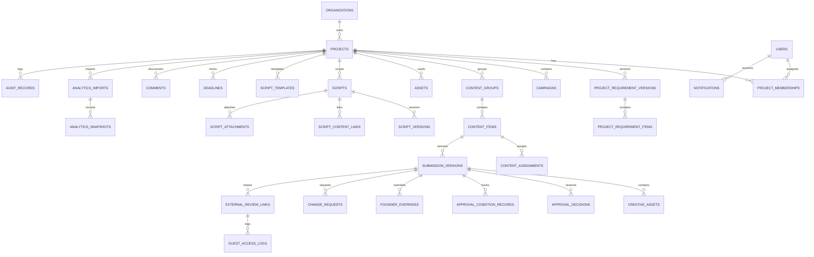
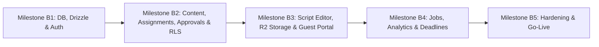

# Phase B Production Architecture & Implementation Proposal (Checkpoint C)

> [!IMPORTANT]
> **Checkpoint C Architecture Proposal (Complete Revision)**: This proposal establishes the complete production architecture, PostgreSQL DDL schema, Row-Level Security (RLS) security definitions, content assignment lifecycle, flexible versioned script editor, operational governance, regional infrastructure, and phased milestone gates for **Ace Assured Phase B**.

---

## 1. Executive Summary & Core Architectural Principles

Phase B migrates the verified Phase A interactive prototype into an enterprise marketing operations platform for Ace Assured. The architecture enforces zero-trust tenant isolation, transactional approval integrity, full assignment accountability, flexible script authoring, strict data retention, and lean operational overhead.

### Architectural Foundation
- **Application Framework**: Next.js 15+ (App Router) on **Vercel Pro** deployed in **Singapore (`sin1`)**.
- **Database & ORM**: **Neon Serverless PostgreSQL 16+** in **AWS Singapore (`ap-southeast-1`)** with **Drizzle ORM** (connection pooling, schema migrations, and point-in-time recovery).
- **Object Storage (Option A — Lean MVP)**: Private **Cloudflare R2** with presigned upload/download URLs (100 MB direct upload limit; zero egress fees; magic-byte validation; safe placeholders for heavy formats).
- **Authentication**: **NextAuth.js (Auth.js v5)** with Google OAuth 2.0 (domain-restricted) and secure HTTP-only cookies.
- **Asynchronous Task Queue**: Reliable PostgreSQL `jobs` table using `FOR UPDATE SKIP LOCKED` driven by **Vercel Cron** and authenticated via `CRON_SECRET`.
- **Tenant Isolation**: PostgreSQL Row-Level Security (RLS) enforced across all tenant-owned tables with unprivileged `app_user` connections and non-recursive `SECURITY DEFINER` membership helpers.
- **Append-Only Auditing**: Immutable audit records protected by database privileges (`REVOKE UPDATE, DELETE, TRUNCATE`) and triggers.
- **Permanent Retention**: Projects cannot be permanently purged; trashed projects transition to a retained read-only archive after 30 days.

---

## 2. Complete Domain Model & PostgreSQL DDL Schema



### Complete DDL (PostgreSQL 16+)

```sql
-- 0. Roles & Permissions Setup (Neither role owns tables nor has BYPASSRLS)
DO $$
BEGIN
  IF NOT EXISTS (SELECT FROM pg_catalog.pg_roles WHERE rolname = 'app_user') THEN
    CREATE ROLE app_user WITH LOGIN PASSWORD 'placeholder_app_password' NOSUPERUSER NOBYPASSRLS NOCREATEDB NOCREATEROLE;
  END IF;
  IF NOT EXISTS (SELECT FROM pg_catalog.pg_roles WHERE rolname = 'app_worker') THEN
    CREATE ROLE app_worker WITH LOGIN PASSWORD 'placeholder_worker_password' NOSUPERUSER NOBYPASSRLS NOCREATEDB NOCREATEROLE;
  END IF;
END $$;

-- 1. Organizations & Projects (Soft Deletion & Retained Archive)
CREATE TABLE organizations (
    id UUID PRIMARY KEY DEFAULT gen_random_uuid(),
    name VARCHAR(255) NOT NULL,
    slug VARCHAR(100) UNIQUE NOT NULL,
    created_at TIMESTAMPTZ NOT NULL DEFAULT NOW(),
    updated_at TIMESTAMPTZ NOT NULL DEFAULT NOW()
);

CREATE TABLE projects (
    id UUID PRIMARY KEY DEFAULT gen_random_uuid(),
    org_id UUID NOT NULL REFERENCES organizations(id) ON DELETE RESTRICT,
    name VARCHAR(255) NOT NULL,
    client_name VARCHAR(255) NOT NULL,
    tier VARCHAR(50) NOT NULL CHECK (tier IN ('tier_1', 'tier_2', 'tier_3')),
    status VARCHAR(50) NOT NULL DEFAULT 'active' CHECK (status IN ('active', 'paused', 'archived', 'trash', 'retained_archive')),
    brand_primary_color VARCHAR(30) DEFAULT '#0071e3',
    brief_markdown TEXT NOT NULL DEFAULT '',
    required_approvers VARCHAR(50) NOT NULL DEFAULT 'both' CHECK (required_approvers IN ('founder', 'consultant', 'both')),
    approval_mode VARCHAR(50) NOT NULL DEFAULT 'parallel' CHECK (approval_mode IN ('parallel', 'sequential')),
    archived_at TIMESTAMPTZ,
    deleted_at TIMESTAMPTZ, -- 30-day trash timestamp
    retained_archived_at TIMESTAMPTZ, -- Set after 30 days in trash; NEVER purged
    created_at TIMESTAMPTZ NOT NULL DEFAULT NOW(),
    updated_at TIMESTAMPTZ NOT NULL DEFAULT NOW(),
    UNIQUE(id, org_id) -- For composite foreign keys
);

CREATE INDEX idx_projects_org_status ON projects(org_id, status);

-- 2. Versioned Project Requirements
CREATE TABLE project_requirement_versions (
    id UUID PRIMARY KEY DEFAULT gen_random_uuid(),
    project_id UUID NOT NULL,
    version_number INT NOT NULL DEFAULT 1,
    effective_month VARCHAR(7) NOT NULL, -- 'YYYY-MM'
    brand_guidelines_md TEXT NOT NULL DEFAULT '',
    target_audience TEXT NOT NULL DEFAULT '',
    scope_summary TEXT NOT NULL DEFAULT '',
    is_active BOOLEAN NOT NULL DEFAULT TRUE,
    created_by_user_id UUID NOT NULL,
    created_at TIMESTAMPTZ NOT NULL DEFAULT NOW(),
    FOREIGN KEY (project_id) REFERENCES projects(id) ON DELETE RESTRICT,
    UNIQUE(project_id, version_number)
);

CREATE TABLE project_requirement_items (
    id UUID PRIMARY KEY DEFAULT gen_random_uuid(),
    requirement_version_id UUID NOT NULL REFERENCES project_requirement_versions(id) ON DELETE RESTRICT,
    format VARCHAR(50) NOT NULL CHECK (format IN ('post', 'carousel', 'reel', 'trial_reel')),
    platform VARCHAR(50) NOT NULL CHECK (platform IN ('Instagram', 'Facebook', 'LinkedIn', 'YouTube', 'X', 'Email')),
    target_quantity INT NOT NULL CHECK (target_quantity >= 0),
    mandatory_tags TEXT[] DEFAULT '{}',
    key_deliverables TEXT NOT NULL DEFAULT '',
    created_at TIMESTAMPTZ NOT NULL DEFAULT NOW()
);

-- 3. Users & Project Memberships
CREATE TABLE users (
    id UUID PRIMARY KEY DEFAULT gen_random_uuid(),
    email VARCHAR(255) UNIQUE NOT NULL,
    full_name VARCHAR(255) NOT NULL,
    avatar_url TEXT,
    is_superadmin BOOLEAN DEFAULT FALSE,
    created_at TIMESTAMPTZ NOT NULL DEFAULT NOW(),
    updated_at TIMESTAMPTZ NOT NULL DEFAULT NOW()
);

CREATE TABLE project_memberships (
    id UUID PRIMARY KEY DEFAULT gen_random_uuid(),
    project_id UUID NOT NULL REFERENCES projects(id) ON DELETE RESTRICT,
    user_id UUID NOT NULL REFERENCES users(id) ON DELETE CASCADE,
    role VARCHAR(50) NOT NULL CHECK (role IN ('admin', 'founder', 'consultant', 'designer')),
    status VARCHAR(50) NOT NULL DEFAULT 'active' CHECK (status IN ('active', 'inactive')),
    created_at TIMESTAMPTZ NOT NULL DEFAULT NOW(),
    UNIQUE(project_id, user_id)
);

CREATE INDEX idx_memberships_user ON project_memberships(user_id, project_id);

-- 4. Campaigns & Content Groups
CREATE TABLE campaigns (
    id UUID PRIMARY KEY DEFAULT gen_random_uuid(),
    project_id UUID NOT NULL REFERENCES projects(id) ON DELETE RESTRICT,
    title VARCHAR(255) NOT NULL,
    description TEXT,
    start_date DATE NOT NULL,
    end_date DATE NOT NULL,
    status VARCHAR(50) NOT NULL DEFAULT 'planning' CHECK (status IN ('planning', 'active', 'completed', 'archived')),
    created_at TIMESTAMPTZ NOT NULL DEFAULT NOW(),
    updated_at TIMESTAMPTZ NOT NULL DEFAULT NOW(),
    UNIQUE(id, project_id)
);

CREATE TABLE content_groups (
    id UUID PRIMARY KEY DEFAULT gen_random_uuid(),
    project_id UUID NOT NULL REFERENCES projects(id) ON DELETE RESTRICT,
    campaign_id UUID,
    name VARCHAR(255) NOT NULL,
    theme VARCHAR(255),
    target_month VARCHAR(7) NOT NULL, -- 'YYYY-MM'
    created_at TIMESTAMPTZ NOT NULL DEFAULT NOW(),
    UNIQUE(id, project_id),
    FOREIGN KEY (campaign_id, project_id) REFERENCES campaigns(id, project_id) ON DELETE SET NULL
);

-- 5. Content Items & Assignments
CREATE TABLE content_items (
    id UUID PRIMARY KEY DEFAULT gen_random_uuid(),
    project_id UUID NOT NULL REFERENCES projects(id) ON DELETE RESTRICT,
    content_group_id UUID,
    campaign_id UUID,
    title VARCHAR(255) NOT NULL,
    platform VARCHAR(50) NOT NULL CHECK (platform IN ('Instagram', 'Facebook', 'LinkedIn', 'YouTube', 'X', 'Email')),
    format VARCHAR(50) NOT NULL CHECK (format IN ('post', 'carousel', 'reel', 'trial_reel')),
    stage VARCHAR(50) NOT NULL DEFAULT 'draft' CHECK (stage IN ('draft', 'review', 'changes_requested', 'approved', 'scheduled', 'published', 'archived')),
    current_version_number INT NOT NULL DEFAULT 1,
    created_by_user_id UUID NOT NULL REFERENCES users(id),
    created_at TIMESTAMPTZ NOT NULL DEFAULT NOW(),
    updated_at TIMESTAMPTZ NOT NULL DEFAULT NOW(),
    UNIQUE(id, project_id),
    FOREIGN KEY (content_group_id, project_id) REFERENCES content_groups(id, project_id) ON DELETE SET NULL,
    FOREIGN KEY (campaign_id, project_id) REFERENCES campaigns(id, project_id) ON DELETE SET NULL
);

CREATE INDEX idx_content_items_project_stage ON content_items(project_id, stage);

-- Complete Content Assignments Table
CREATE TABLE content_assignments (
    id UUID PRIMARY KEY DEFAULT gen_random_uuid(),
    project_id UUID NOT NULL,
    content_item_id UUID NOT NULL,
    assignee_user_id UUID NOT NULL REFERENCES users(id),
    assignment_role VARCHAR(50) NOT NULL CHECK (assignment_role IN ('designer', 'video_editor', 'collaborator')),
    status VARCHAR(50) NOT NULL CHECK (status IN ('assigned', 'accepted', 'in_progress', 'submitted', 'reassigned', 'completed')),
    assigned_by_user_id UUID NOT NULL REFERENCES users(id),
    assigned_at TIMESTAMPTZ NOT NULL DEFAULT NOW(),
    accepted_at TIMESTAMPTZ,
    started_at TIMESTAMPTZ,
    completed_at TIMESTAMPTZ,
    due_at TIMESTAMPTZ NOT NULL,
    reassignment_reason TEXT,
    replaced_assignment_id UUID REFERENCES content_assignments(id),
    created_at TIMESTAMPTZ NOT NULL DEFAULT NOW(),
    updated_at TIMESTAMPTZ NOT NULL DEFAULT NOW(),
    FOREIGN KEY (content_item_id, project_id) REFERENCES content_items(id, project_id) ON DELETE RESTRICT
);

-- Partial Unique Index: Only ONE active primary assignment per content item
CREATE UNIQUE INDEX uq_active_content_assignment ON content_assignments (content_item_id, assignment_role) 
WHERE status IN ('assigned', 'accepted', 'in_progress');

CREATE INDEX idx_assignments_assignee ON content_assignments(assignee_user_id, status);

-- 6. Submission Versions & Unified Creative Assets
CREATE TABLE submission_versions (
    id UUID PRIMARY KEY DEFAULT gen_random_uuid(),
    content_item_id UUID NOT NULL,
    project_id UUID NOT NULL,
    version_number INT NOT NULL,
    is_draft BOOLEAN NOT NULL DEFAULT TRUE,
    caption TEXT NOT NULL DEFAULT '',
    hashtags TEXT[] DEFAULT '{}',
    cta TEXT DEFAULT '',
    destination_url TEXT DEFAULT '',
    scheduled_date TIMESTAMPTZ,
    copy_fingerprint VARCHAR(64) NOT NULL,
    creative_fingerprint VARCHAR(64) NOT NULL,
    posting_date_fingerprint VARCHAR(64) NOT NULL,
    snapshot_required_approvers VARCHAR(50) NOT NULL DEFAULT 'both',
    snapshot_approval_mode VARCHAR(50) NOT NULL DEFAULT 'parallel',
    submitted_by_user_id UUID REFERENCES users(id),
    submitted_at TIMESTAMPTZ,
    created_at TIMESTAMPTZ NOT NULL DEFAULT NOW(),
    UNIQUE(id, project_id, content_item_id),
    UNIQUE(content_item_id, version_number),
    FOREIGN KEY (content_item_id, project_id) REFERENCES content_items(id, project_id) ON DELETE RESTRICT
);

CREATE INDEX idx_submission_versions_item ON submission_versions(content_item_id, version_number);

CREATE TABLE creative_assets (
    id UUID PRIMARY KEY DEFAULT gen_random_uuid(),
    submission_version_id UUID NOT NULL,
    content_item_id UUID NOT NULL,
    project_id UUID NOT NULL,
    source_type VARCHAR(20) NOT NULL CHECK (source_type IN ('r2_upload', 'drive_link')),
    filename VARCHAR(255) NOT NULL,
    r2_key TEXT,
    file_size_bytes BIGINT,
    mime_type VARCHAR(100),
    magic_bytes VARCHAR(32),
    content_hash VARCHAR(64), -- SHA-256
    status VARCHAR(50) NOT NULL DEFAULT 'pending_upload' CHECK (status IN ('pending_upload', 'ready', 'rejected', 'archived')),
    drive_url TEXT,
    drive_file_id VARCHAR(255),
    created_at TIMESTAMPTZ NOT NULL DEFAULT NOW(),
    FOREIGN KEY (submission_version_id, project_id, content_item_id) REFERENCES submission_versions(id, project_id, content_item_id) ON DELETE RESTRICT,
    CONSTRAINT chk_asset_source_valid CHECK (
      (source_type = 'r2_upload' AND r2_key IS NOT NULL AND content_hash IS NOT NULL AND file_size_bytes <= 104857600) OR
      (source_type = 'drive_link' AND drive_url IS NOT NULL)
    )
);

-- 7. Asset Vault (Project-Level Master Assets)
CREATE TABLE assets (
    id UUID PRIMARY KEY DEFAULT gen_random_uuid(),
    project_id UUID NOT NULL REFERENCES projects(id) ON DELETE RESTRICT,
    name VARCHAR(255) NOT NULL,
    source_type VARCHAR(20) NOT NULL CHECK (source_type IN ('r2_upload', 'drive_link')),
    r2_key TEXT,
    file_size_bytes BIGINT,
    mime_type VARCHAR(100),
    drive_url TEXT,
    tags TEXT[] DEFAULT '{}',
    status VARCHAR(50) NOT NULL DEFAULT 'ready' CHECK (status IN ('pending_upload', 'ready', 'archived')),
    uploaded_by_user_id UUID NOT NULL REFERENCES users(id),
    created_at TIMESTAMPTZ NOT NULL DEFAULT NOW()
);

-- 8. Flexible, Versioned Script Editor System
CREATE TABLE scripts (
    id UUID PRIMARY KEY DEFAULT gen_random_uuid(),
    project_id UUID NOT NULL REFERENCES projects(id) ON DELETE RESTRICT,
    campaign_id UUID,
    title VARCHAR(255) NOT NULL,
    mode VARCHAR(50) NOT NULL CHECK (mode IN ('structured', 'freeform')),
    status VARCHAR(50) NOT NULL DEFAULT 'draft' CHECK (status IN ('draft', 'review', 'approved', 'in_production', 'archived')),
    current_version_number INT NOT NULL DEFAULT 1,
    owner_user_id UUID NOT NULL REFERENCES users(id),
    created_at TIMESTAMPTZ NOT NULL DEFAULT NOW(),
    updated_at TIMESTAMPTZ NOT NULL DEFAULT NOW(),
    UNIQUE(id, project_id),
    FOREIGN KEY (campaign_id, project_id) REFERENCES campaigns(id, project_id) ON DELETE SET NULL
);

CREATE TABLE script_versions (
    id UUID PRIMARY KEY DEFAULT gen_random_uuid(),
    script_id UUID NOT NULL,
    project_id UUID NOT NULL,
    version_number INT NOT NULL,
    mode VARCHAR(50) NOT NULL CHECK (mode IN ('structured', 'freeform')),
    structured_content JSONB, -- { hook: string, scenes: Array<{ scene_number, visual_direction, dialogue_voiceover, audio, on_screen_text, duration_seconds }>, cta: string }
    freeform_blocks JSONB, -- Array<{ id, type: 'heading'|'paragraph'|'list'|'table'|'checklist'|'quote'|'dialogue'|'notes'|'divider'|'custom_section', custom_title, content, order }>
    searchable_plain_text TEXT NOT NULL,
    change_summary TEXT,
    is_submitted BOOLEAN NOT NULL DEFAULT FALSE,
    created_by_user_id UUID NOT NULL REFERENCES users(id),
    created_at TIMESTAMPTZ NOT NULL DEFAULT NOW(),
    UNIQUE(script_id, version_number),
    FOREIGN KEY (script_id, project_id) REFERENCES scripts(id, project_id) ON DELETE RESTRICT
);

CREATE TABLE script_content_links (
    id UUID PRIMARY KEY DEFAULT gen_random_uuid(),
    script_id UUID NOT NULL,
    content_item_id UUID NOT NULL,
    project_id UUID NOT NULL,
    created_at TIMESTAMPTZ NOT NULL DEFAULT NOW(),
    UNIQUE(script_id, content_item_id),
    FOREIGN KEY (script_id, project_id) REFERENCES scripts(id, project_id) ON DELETE CASCADE,
    FOREIGN KEY (content_item_id, project_id) REFERENCES content_items(id, project_id) ON DELETE CASCADE
);

CREATE TABLE script_attachments (
    id UUID PRIMARY KEY DEFAULT gen_random_uuid(),
    script_id UUID NOT NULL,
    project_id UUID NOT NULL,
    source_type VARCHAR(20) NOT NULL CHECK (source_type IN ('r2_upload', 'drive_link')),
    filename VARCHAR(255) NOT NULL,
    r2_key TEXT,
    file_size_bytes BIGINT,
    mime_type VARCHAR(100),
    drive_url TEXT,
    created_at TIMESTAMPTZ NOT NULL DEFAULT NOW(),
    FOREIGN KEY (script_id, project_id) REFERENCES scripts(id, project_id) ON DELETE CASCADE
);

CREATE TABLE script_templates (
    id UUID PRIMARY KEY DEFAULT gen_random_uuid(),
    project_id UUID REFERENCES projects(id) ON DELETE CASCADE, -- NULL = System Global Template
    name VARCHAR(255) NOT NULL,
    description TEXT,
    mode VARCHAR(50) NOT NULL CHECK (mode IN ('structured', 'freeform')),
    template_payload JSONB NOT NULL,
    is_system BOOLEAN NOT NULL DEFAULT FALSE,
    created_by_user_id UUID REFERENCES users(id),
    created_at TIMESTAMPTZ NOT NULL DEFAULT NOW()
);

-- 9. Approvals, Revocations & Conditions
CREATE TABLE approval_decisions (
    id UUID PRIMARY KEY DEFAULT gen_random_uuid(),
    project_id UUID NOT NULL,
    content_item_id UUID NOT NULL,
    submission_version_id UUID NOT NULL,
    component VARCHAR(50) NOT NULL CHECK (component IN ('copy', 'creative', 'posting_date')),
    component_fingerprint VARCHAR(64) NOT NULL,
    reviewer_user_id UUID NOT NULL REFERENCES users(id),
    reviewer_role VARCHAR(50) NOT NULL CHECK (reviewer_role IN ('founder', 'consultant')),
    decision VARCHAR(50) NOT NULL CHECK (decision IN ('approved', 'rejected', 'changes_requested', 'approved_with_conditions')),
    conditions TEXT,
    note TEXT,
    is_active BOOLEAN NOT NULL DEFAULT TRUE,
    revoked_at TIMESTAMPTZ,
    revoked_by_user_id UUID REFERENCES users(id),
    revocation_reason TEXT,
    decided_at TIMESTAMPTZ NOT NULL DEFAULT NOW(),
    UNIQUE(id, project_id, submission_version_id, content_item_id),
    FOREIGN KEY (submission_version_id, project_id, content_item_id) REFERENCES submission_versions(id, project_id, content_item_id) ON DELETE RESTRICT
);

CREATE UNIQUE INDEX uq_active_approval_decision ON approval_decisions (submission_version_id, component, reviewer_user_id) WHERE (is_active = TRUE);

CREATE TABLE approval_condition_records (
    id UUID PRIMARY KEY DEFAULT gen_random_uuid(),
    approval_decision_id UUID NOT NULL REFERENCES approval_decisions(id) ON DELETE RESTRICT,
    condition_text TEXT NOT NULL,
    is_satisfied BOOLEAN NOT NULL DEFAULT FALSE,
    satisfied_at TIMESTAMPTZ,
    satisfied_by_user_id UUID REFERENCES users(id),
    satisfaction_notes TEXT,
    created_at TIMESTAMPTZ NOT NULL DEFAULT NOW()
);

CREATE TABLE change_requests (
    id UUID PRIMARY KEY DEFAULT gen_random_uuid(),
    project_id UUID NOT NULL,
    content_item_id UUID NOT NULL,
    submission_version_id UUID NOT NULL,
    component VARCHAR(50) NOT NULL CHECK (component IN ('copy', 'creative', 'posting_date', 'general')),
    requested_by_user_id UUID NOT NULL REFERENCES users(id),
    requested_by_role VARCHAR(50) NOT NULL CHECK (requested_by_role IN ('founder', 'consultant')),
    description TEXT NOT NULL,
    conditions TEXT,
    designer_response TEXT,
    resolved_in_version_id UUID,
    status VARCHAR(50) NOT NULL DEFAULT 'open' CHECK (status IN ('open', 'addressed', 'resolved', 'waived', 'disputed')),
    created_at TIMESTAMPTZ NOT NULL DEFAULT NOW(),
    updated_at TIMESTAMPTZ NOT NULL DEFAULT NOW(),
    FOREIGN KEY (submission_version_id, project_id, content_item_id) REFERENCES submission_versions(id, project_id, content_item_id) ON DELETE RESTRICT,
    FOREIGN KEY (resolved_in_version_id, project_id, content_item_id) REFERENCES submission_versions(id, project_id, content_item_id) ON DELETE SET NULL
);

CREATE TABLE founder_overrides (
    id UUID PRIMARY KEY DEFAULT gen_random_uuid(),
    project_id UUID NOT NULL,
    content_item_id UUID NOT NULL,
    submission_version_id UUID NOT NULL,
    component VARCHAR(50),
    reason TEXT NOT NULL,
    actor_user_id UUID NOT NULL REFERENCES users(id),
    created_at TIMESTAMPTZ NOT NULL DEFAULT NOW(),
    FOREIGN KEY (submission_version_id, project_id, content_item_id) REFERENCES submission_versions(id, project_id, content_item_id) ON DELETE RESTRICT
);

-- 10. Deadlines & Milestones
CREATE TABLE deadlines (
    id UUID PRIMARY KEY DEFAULT gen_random_uuid(),
    project_id UUID NOT NULL,
    content_item_id UUID NOT NULL,
    kind VARCHAR(50) NOT NULL CHECK (kind IN ('submission', 'resubmission', 'approval_target', 'scheduled_publication')),
    due_at TIMESTAMPTZ NOT NULL,
    status VARCHAR(50) NOT NULL DEFAULT 'on_track' CHECK (status IN ('on_track', 'approaching', 'overdue', 'met')),
    escalated_at TIMESTAMPTZ,
    last_notified_at TIMESTAMPTZ,
    created_at TIMESTAMPTZ NOT NULL DEFAULT NOW(),
    updated_at TIMESTAMPTZ NOT NULL DEFAULT NOW(),
    FOREIGN KEY (content_item_id, project_id) REFERENCES content_items(id, project_id) ON DELETE RESTRICT
);

-- 11. External Guest Review Tokens & Access Log
CREATE TABLE external_review_links (
    id UUID PRIMARY KEY DEFAULT gen_random_uuid(),
    project_id UUID NOT NULL,
    content_item_id UUID NOT NULL,
    submission_version_id UUID NOT NULL,
    token_hash VARCHAR(64) UNIQUE NOT NULL, -- SHA-256 of 32-byte opaque random token
    allow_download BOOLEAN NOT NULL DEFAULT FALSE,
    expires_at TIMESTAMPTZ NOT NULL,
    revoked_at TIMESTAMPTZ,
    created_by_user_id UUID NOT NULL REFERENCES users(id),
    created_at TIMESTAMPTZ NOT NULL DEFAULT NOW(),
    UNIQUE(id, project_id, submission_version_id, content_item_id),
    FOREIGN KEY (submission_version_id, project_id, content_item_id) REFERENCES submission_versions(id, project_id, content_item_id) ON DELETE RESTRICT
);

CREATE TABLE guest_access_logs (
    id UUID PRIMARY KEY DEFAULT gen_random_uuid(),
    external_review_link_id UUID NOT NULL REFERENCES external_review_links(id) ON DELETE RESTRICT,
    ip_address INET NOT NULL,
    user_agent TEXT,
    action VARCHAR(50) NOT NULL CHECK (action IN ('view', 'comment', 'download')),
    accessed_at TIMESTAMPTZ NOT NULL DEFAULT NOW()
);

-- 12. Collaboration: Comments (Internal & Scoped Guest Discussions)
CREATE TABLE comments (
    id UUID PRIMARY KEY DEFAULT gen_random_uuid(),
    project_id UUID NOT NULL,
    content_item_id UUID NOT NULL,
    submission_version_id UUID NOT NULL,
    external_review_link_id UUID,
    author_user_id UUID REFERENCES users(id),
    author_name VARCHAR(255) NOT NULL,
    author_role VARCHAR(50) NOT NULL,
    is_external_guest BOOLEAN NOT NULL DEFAULT FALSE,
    text TEXT NOT NULL,
    annotation JSONB,
    is_resolved BOOLEAN NOT NULL DEFAULT FALSE,
    resolved_by_user_id UUID REFERENCES users(id),
    created_at TIMESTAMPTZ NOT NULL DEFAULT NOW(),
    FOREIGN KEY (submission_version_id, project_id, content_item_id) REFERENCES submission_versions(id, project_id, content_item_id) ON DELETE RESTRICT,
    FOREIGN KEY (external_review_link_id, project_id, submission_version_id, content_item_id) REFERENCES external_review_links(id, project_id, submission_version_id, content_item_id) ON DELETE RESTRICT
);

CREATE INDEX idx_comments_guest_thread ON comments(external_review_link_id) WHERE is_external_guest = TRUE;

-- 13. Notifications
CREATE TABLE notifications (
    id UUID PRIMARY KEY DEFAULT gen_random_uuid(),
    user_id UUID NOT NULL REFERENCES users(id) ON DELETE CASCADE,
    project_id UUID NOT NULL REFERENCES projects(id) ON DELETE RESTRICT,
    content_item_id UUID,
    title VARCHAR(255) NOT NULL,
    message TEXT NOT NULL,
    type VARCHAR(50) NOT NULL CHECK (type IN ('assignment_created', 'approval_required', 'changes_requested', 'deadline_approaching', 'deadline_overdue', 'override_applied', 'comment_added')),
    is_read BOOLEAN NOT NULL DEFAULT FALSE,
    created_at TIMESTAMPTZ NOT NULL DEFAULT NOW()
);

CREATE INDEX idx_notifications_user ON notifications(user_id, is_read, created_at DESC);

-- 14. Analytics Imports & Snapshots
CREATE TABLE analytics_imports (
    id UUID PRIMARY KEY DEFAULT gen_random_uuid(),
    project_id UUID NOT NULL REFERENCES projects(id) ON DELETE RESTRICT,
    filename VARCHAR(255) NOT NULL,
    file_type VARCHAR(10) NOT NULL CHECK (file_type IN ('csv', 'xlsx')),
    imported_by_user_id UUID NOT NULL REFERENCES users(id),
    total_rows INT NOT NULL,
    valid_rows INT NOT NULL,
    duplicate_rows INT NOT NULL,
    created_at TIMESTAMPTZ NOT NULL DEFAULT NOW(),
    UNIQUE(id, project_id)
);

CREATE TABLE analytics_snapshots (
    id UUID PRIMARY KEY DEFAULT gen_random_uuid(),
    project_id UUID NOT NULL,
    import_batch_id UUID NOT NULL,
    content_item_id UUID,
    snapshot_date DATE NOT NULL,
    platform VARCHAR(50) NOT NULL CHECK (platform IN ('Instagram', 'Facebook', 'LinkedIn', 'YouTube', 'X', 'Email')),
    reach BIGINT NOT NULL DEFAULT 0,
    impressions BIGINT NOT NULL DEFAULT 0,
    engagement_rate NUMERIC(6,3) NOT NULL DEFAULT 0.000,
    clicks BIGINT NOT NULL DEFAULT 0,
    leads BIGINT NOT NULL DEFAULT 0,
    revenue_inr NUMERIC(12,2) NOT NULL DEFAULT 0.00,
    dedup_hash VARCHAR(64) NOT NULL,
    created_at TIMESTAMPTZ NOT NULL DEFAULT NOW(),
    UNIQUE(project_id, dedup_hash),
    FOREIGN KEY (import_batch_id, project_id) REFERENCES analytics_imports(id, project_id) ON DELETE RESTRICT,
    FOREIGN KEY (content_item_id, project_id) REFERENCES content_items(id, project_id) ON DELETE SET NULL
);

CREATE INDEX idx_analytics_project_date ON analytics_snapshots(project_id, snapshot_date);

-- 15. Publication Records
CREATE TABLE publication_records (
    id UUID PRIMARY KEY DEFAULT gen_random_uuid(),
    project_id UUID NOT NULL,
    content_item_id UUID NOT NULL,
    submission_version_id UUID NOT NULL,
    published_at TIMESTAMPTZ NOT NULL DEFAULT NOW(),
    live_url TEXT NOT NULL,
    external_edit_occurred BOOLEAN NOT NULL DEFAULT FALSE,
    external_edit_note TEXT,
    published_by_user_id UUID NOT NULL REFERENCES users(id),
    FOREIGN KEY (submission_version_id, project_id, content_item_id) REFERENCES submission_versions(id, project_id, content_item_id) ON DELETE RESTRICT
);

-- 16. Reliable PostgreSQL Jobs Queue
CREATE TABLE jobs (
    id UUID PRIMARY KEY DEFAULT gen_random_uuid(),
    idempotency_key VARCHAR(255) UNIQUE NOT NULL,
    queue VARCHAR(50) NOT NULL DEFAULT 'default',
    task_type VARCHAR(100) NOT NULL,
    payload JSONB NOT NULL DEFAULT '{}'::jsonb,
    status VARCHAR(50) NOT NULL DEFAULT 'pending' CHECK (status IN ('pending', 'processing', 'completed', 'failed', 'dead')),
    attempts INT NOT NULL DEFAULT 0,
    max_attempts INT NOT NULL DEFAULT 5,
    last_error TEXT,
    locked_by VARCHAR(100),
    locked_until TIMESTAMPTZ,
    started_at TIMESTAMPTZ,
    completed_at TIMESTAMPTZ,
    scheduled_for TIMESTAMPTZ NOT NULL DEFAULT NOW(),
    created_at TIMESTAMPTZ NOT NULL DEFAULT NOW(),
    updated_at TIMESTAMPTZ NOT NULL DEFAULT NOW()
);

CREATE INDEX idx_jobs_claim ON jobs(status, scheduled_for) WHERE status IN ('pending', 'processing');

-- 17. Truly Append-Only Audit Trail
CREATE TABLE audit_records (
    id UUID PRIMARY KEY DEFAULT gen_random_uuid(),
    project_id UUID REFERENCES projects(id) ON DELETE RESTRICT,
    content_item_id UUID,
    action VARCHAR(100) NOT NULL,
    actor_user_id UUID NOT NULL REFERENCES users(id),
    actor_role VARCHAR(50) NOT NULL,
    details JSONB NOT NULL DEFAULT '{}'::jsonb,
    ip_address INET,
    user_agent TEXT,
    created_at TIMESTAMPTZ NOT NULL DEFAULT NOW()
);

CREATE INDEX idx_audit_project_created ON audit_records(project_id, created_at DESC);

-- Privilege Revocations for Append-Only Security
REVOKE UPDATE, DELETE, TRUNCATE ON audit_records FROM PUBLIC, app_user, app_worker;

CREATE OR REPLACE FUNCTION protect_audit_records()
RETURNS TRIGGER AS $$
BEGIN
    RAISE EXCEPTION 'Audit records are strictly append-only and cannot be updated or deleted.';
END;
$$ LANGUAGE plpgsql;

CREATE TRIGGER trg_protect_audit_records
BEFORE UPDATE OR DELETE ON audit_records
FOR EACH ROW EXECUTE FUNCTION protect_audit_records();

-- 18. GRANT Permissions for Application & Worker Roles
GRANT USAGE ON SCHEMA public TO app_user, app_worker;
GRANT SELECT, INSERT, UPDATE, DELETE ON ALL TABLES IN SCHEMA public TO app_user;
REVOKE UPDATE, DELETE, TRUNCATE ON audit_records FROM app_user;
GRANT SELECT, UPDATE ON jobs TO app_worker;
GRANT SELECT, INSERT ON audit_records, notifications TO app_worker;
```

---

## 3. PostgreSQL Row-Level Security (RLS) Architecture

### 1. Non-Recursive Security Definer Helper Function
```sql
CREATE OR REPLACE FUNCTION user_has_project_role(
  p_user_id UUID,
  p_project_id UUID,
  p_roles TEXT[] DEFAULT NULL
)
RETURNS BOOLEAN
LANGUAGE plpgsql
SECURITY DEFINER
SET search_path = public
STABLE
AS $$
BEGIN
  IF p_user_id IS NULL OR p_project_id IS NULL THEN
    RETURN FALSE;
  END IF;
  
  IF p_roles IS NULL THEN
    RETURN EXISTS (
      SELECT 1 FROM project_memberships
      WHERE user_id = p_user_id
        AND project_id = p_project_id
        AND status = 'active'
    );
  ELSE
    RETURN EXISTS (
      SELECT 1 FROM project_memberships
      WHERE user_id = p_user_id
        AND project_id = p_project_id
        AND status = 'active'
        AND role = ANY(p_roles)
    );
  END IF;
END;
$$;
```

### 2. Comprehensive Table RLS Policies
```sql
-- Enable RLS across all project-owned tables
ALTER TABLE projects ENABLE ROW LEVEL SECURITY;
ALTER TABLE project_memberships ENABLE ROW LEVEL SECURITY;
ALTER TABLE project_requirement_versions ENABLE ROW LEVEL SECURITY;
ALTER TABLE project_requirement_items ENABLE ROW LEVEL SECURITY;
ALTER TABLE campaigns ENABLE ROW LEVEL SECURITY;
ALTER TABLE content_groups ENABLE ROW LEVEL SECURITY;
ALTER TABLE content_items ENABLE ROW LEVEL SECURITY;
ALTER TABLE content_assignments ENABLE ROW LEVEL SECURITY;
ALTER TABLE scripts ENABLE ROW LEVEL SECURITY;
ALTER TABLE script_versions ENABLE ROW LEVEL SECURITY;
ALTER TABLE script_content_links ENABLE ROW LEVEL SECURITY;
ALTER TABLE script_attachments ENABLE ROW LEVEL SECURITY;
ALTER TABLE script_templates ENABLE ROW LEVEL SECURITY;
ALTER TABLE submission_versions ENABLE ROW LEVEL SECURITY;
ALTER TABLE creative_assets ENABLE ROW LEVEL SECURITY;
ALTER TABLE approval_decisions ENABLE ROW LEVEL SECURITY;
ALTER TABLE approval_condition_records ENABLE ROW LEVEL SECURITY;
ALTER TABLE change_requests ENABLE ROW LEVEL SECURITY;
ALTER TABLE founder_overrides ENABLE ROW LEVEL SECURITY;
ALTER TABLE deadlines ENABLE ROW LEVEL SECURITY;
ALTER TABLE comments ENABLE ROW LEVEL SECURITY;
ALTER TABLE analytics_imports ENABLE ROW LEVEL SECURITY;
ALTER TABLE analytics_snapshots ENABLE ROW LEVEL SECURITY;
ALTER TABLE publication_records ENABLE ROW LEVEL SECURITY;
ALTER TABLE audit_records ENABLE ROW LEVEL SECURITY;
ALTER TABLE jobs ENABLE ROW LEVEL SECURITY;

CREATE OR REPLACE FUNCTION current_app_user_id() RETURNS UUID AS $$
BEGIN
  RETURN NULLIF(current_setting('app.current_user_id', true), '')::UUID;
END;
$$ LANGUAGE plpgsql STABLE;

-- Content Assignments RLS
CREATE POLICY assignment_select_policy ON content_assignments
FOR SELECT TO app_user
USING (user_has_project_role(current_app_user_id(), project_id));

CREATE POLICY assignment_mutation_policy ON content_assignments
FOR ALL TO app_user
USING (user_has_project_role(current_app_user_id(), project_id, ARRAY['admin', 'founder', 'consultant']))
WITH CHECK (user_has_project_role(current_app_user_id(), project_id, ARRAY['admin', 'founder', 'consultant']));

-- Scripts RLS
CREATE POLICY script_select_policy ON scripts
FOR SELECT TO app_user
USING (user_has_project_role(current_app_user_id(), project_id));

CREATE POLICY script_mutation_policy ON scripts
FOR ALL TO app_user
USING (user_has_project_role(current_app_user_id(), project_id))
WITH CHECK (user_has_project_role(current_app_user_id(), project_id));
```

---

## 4. Content Assignment & Workload Architecture

### 1. Assignment Lifecycle State Machine
1. **Creation**: Admin/Founder/Consultant assigns content item with a defined role (`designer`, `video_editor`, `collaborator`) and `due_at` date.
2. **Submission Deadline Creation**: Automatically creates a record in `deadlines` with `kind = 'submission'` and `due_at`.
3. **Assignee Notification**: System emits `assignment_created` in-app notification to the assignee.
4. **Reassignment Ledger**:
   - Updates previous assignment record to `status = 'reassigned'` and populates `reassignment_reason`.
   - Inserts new assignment with `replaced_assignment_id` referencing the previous record.
5. **Auditing**: Emits structured records to `audit_records` on `assigned`, `accepted`, `in_progress`, `submitted`, `reassigned`, and `completed`.

### 2. Cross-Project My Work & Workload Views
- **Cross-Project My Work**: Queries `content_assignments` where `assignee_user_id = current_user.id` and `status IN ('assigned', 'accepted', 'in_progress')` across all projects.
- **Unassigned Content View**: Queries `content_items` where no active `content_assignments` exist.
- **Designer Workload Matrix**: Aggregates active task counts and approaching deadlines per team member.

---

## 5. Flexible, Versioned Script Editor Architecture

### 1. Multi-Mode Scripting
- **Structured Mode**:
  - Rigid schema: `hook`, `scenes` array (visual direction, voice-over, audio, on-screen text, duration), and `cta`.
- **Freeform Mode**:
  - Flexible block array supporting headings, paragraphs, lists, tables, checklists, quotes, dialogue, notes, dividers, and custom user-named sections (`custom_section`).
  - No mandatory Hook, Scene, or CTA constraints.

### 2. Versioning & Content Linking
- **Autosave & Version Snapshots**: Drafts autosave periodically. Submitting for review creates an immutable `script_versions` snapshot (`is_submitted = TRUE`).
- **Version Restoration**: Restoring an older version creates a new version containing the historical content without mutating previous history.
- **Many-to-Many Script Linking**: `script_content_links` allows a single master script to link to multiple platform-specific deliverables (e.g. 1 master script $\to$ Instagram Reel, YouTube Short, and LinkedIn Post).
- **Template System**: `script_templates` allows non-developers to save and deploy reusable structured or freeform script blueprints across projects.

---

## 6. UI Specifications for Phase B Components

1. **Assign Designer Modal**:
   - Project member selector filtered by role.
   - Designer live workload badge (e.g. "Vikram Shah (2 active tasks)").
   - Submission deadline picker with instant SLA validation.
2. **My Work Assignment Queue**:
   - Grouped by project with status pill badges (`assigned`, `in_progress`, `overdue`).
   - Quick "Accept" and "Start" action buttons.
3. **Script Editor Interface**:
   - Header with Mode Toggle (**Structured** vs. **Freeform**).
   - Dynamic block toolbar: "Add Heading", "Add Dialogue", "Add Table", "Add Custom Section".
   - Drag-and-drop handles for section reordering.
   - Version History Slideout Panel with Side-by-Side Diff Comparison and "Restore Version" button.
   - Attachments & Google Drive reference links drawer.

---

## 7. Complete File Handling & Preview Matrix (Option A — Lean MVP)

| File Type | MIME Whitelist | Magic Bytes Header (Hex) | Direct Upload Limit | Preview & Presentation Strategy |
| :--- | :--- | :--- | :---: | :--- |
| **JPEG / JPG** | `image/jpeg` | `FF D8 FF` | 100 MB | Direct browser preview (`<SafeImage />`) via presigned R2 URL. |
| **PNG** | `image/png` | `89 50 4E 47 0D 0A 1A 0A` | 100 MB | Direct browser preview (`<SafeImage />`) via presigned R2 URL. |
| **SVG** | `image/svg+xml` | `3C 73 76 67` (`<svg`) | 100 MB | **Server-side sanitization** (DOMPurify/sanitize-svg), rendered in sandboxed frame. |
| **HEIC** | `image/heic`, `image/heif` | `... 66 74 79 70 68 65 69 63` | 100 MB | **Option A**: Clean format placeholder badge; download original via presigned URL. |
| **MP4** | `video/mp4` | `... 66 74 79 70` (ftyp) | 100 MB | Native HTML5 `<video controls />` stream via presigned URL. |
| **MOV** | `video/quicktime` | `... 66 74 79 70 71 74` | 100 MB | Native video playback on Safari; format placeholder badge on non-Safari browsers; direct download. |
| **MP3** | `audio/mpeg` | `49 44 33` / `FF FB` | 100 MB | Native HTML5 `<audio controls />` player. |
| **WAV** | `audio/wav` | `52 49 46 46 ... 57 41 56 45` | 100 MB | Native HTML5 `<audio controls />` player with waveform visualizer. |
| **PDF** | `application/pdf` | `25 50 44 46` (`%PDF`) | 100 MB | PDF document badge with filename/size; full document download via presigned URL. |
| **PSD** | `image/vnd.adobe.photoshop` | `38 42 50 53` (`8BPS`) | 100 MB | PSD placeholder icon with dimensions; download original via presigned URL. |
| **Files > 100 MB** | Any | Any | Unlimited | **Redirected to Google Drive link workflow** (`source_type = 'drive_link'`). |

---

## 8. Regional Architecture & Infrastructure Cost Model

### Production Hosting Regions
- **Database (Neon)**: **AWS Singapore (`ap-southeast-1`)**.
- **Compute (Vercel)**: **Singapore (`sin1`)** Serverless Edge & Node.js functions (sub-5ms database latency).
- **Object Storage (Cloudflare R2)**: APAC regional location hint (private bucket; zero egress fees).

### Infrastructure Cost Model

| Provider | Service Tier | Pricing Model | Monthly Cost |
| :--- | :--- | :--- | :---: |
| **Vercel** | Vercel Pro | $20.00 / month for 1 deploying seat | $20.00 |
| **Neon** | Usage-Based (Launch) | $0/mo Free tier (dev) / ~$10–$20/mo production ($0.16/CU-hr, $0.75/GB storage) | ~$10 – $20 |
| **Cloudflare R2** | Pay-as-you-go | First 10 GB-mo free; $0.015 / GB-mo stored; **$0 egress** | $0.00 – $1.35 |
| **Cloudflare** | Domain Registration | $10–$15 / year domain registration | ~$1.00 |
| **Total Expected Initial Cost** | | | **~$31.00 – $42.35 / month** |

---

## 9. Phased Milestone Acceptance Gates



### Milestone Acceptance Criteria

| Milestone | Deliverables | Verification & Automated Tests | Security & Isolation Tests | Migration & Rollback Procedure | Review Checkpoint |
| :--- | :--- | :--- | :--- | :--- | :--- |
| **B1: DB, Drizzle & Auth** | Drizzle schema, Neon migrations, NextAuth Google OAuth, unprivileged `app_user` role. | Drizzle schema check, session cookie expiry tests, user creation tests. | CSRF prevention, `SameSite=Lax` cookies, SQL injection fuzzing. | Forward-only migration review; pre-migration backup. | User review of Google login & project switcher. |
| **B2: Content, Assignments & Approvals** | Content versioning, `content_assignments` lifecycle, canonical fingerprints, approval decisions, append-only audit trigger. | Fingerprint stability tests, assignment permission tests, reassignment history tests, workload calculation tests. | Cross-project composite FK tests, RLS policy tests, Designer 403 analytics restriction. | Forward-fix migration scripts; rollback restore dry-run test. | User review of assignments, multi-approver workflow & audit trail. |
| **B3: Script Editor, R2 Storage & Guest Portal** | Multi-mode script editor (structured/freeform), script versions/templates, presigned R2 uploads, opaque 32-byte guest review portal. | Script block serialization tests, version restoration tests, magic-byte spoofing tests, Drive attachment tests. | Guest scoped thread isolation tests, token brute-force rate limit tests. | R2 bucket CORS policy dry-run; storage rollback script. | Live mobile/desktop guest review verification. |
| **B4: Jobs Queue, Analytics & Deadlines** | PostgreSQL `jobs` engine (`FOR UPDATE SKIP LOCKED`), Vercel Cron handler, CSV/XLSX parser, deadline alerts. | Job idempotency tests, exponential backoff tests, spreadsheet deduplication suite. | `CRON_SECRET` authentication test, formula injection sanitization test. | Queue drain script and task replay procedure. | User review of analytics dashboards & deadline alerts. |
| **B5: Hardening & Production Go-Live** | Playwright E2E suite, load testing, logical backup cron, disaster recovery drill, DNS cutover. | Complete Playwright E2E suite (100% pass across all user roles). | OWASP Top 10 automated security audit, penetration scan. | Full disaster recovery restore drill from encrypted `pg_dump`. | Final production signoff and DNS launch. |
